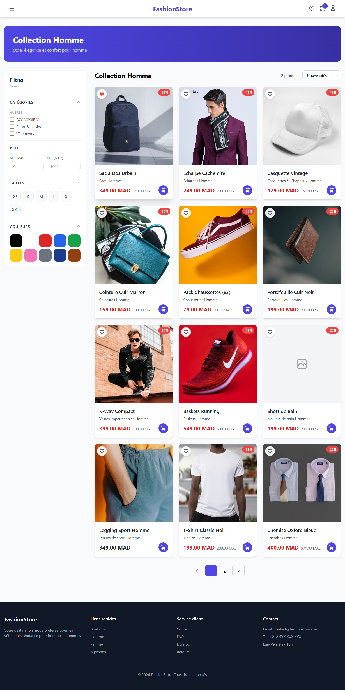
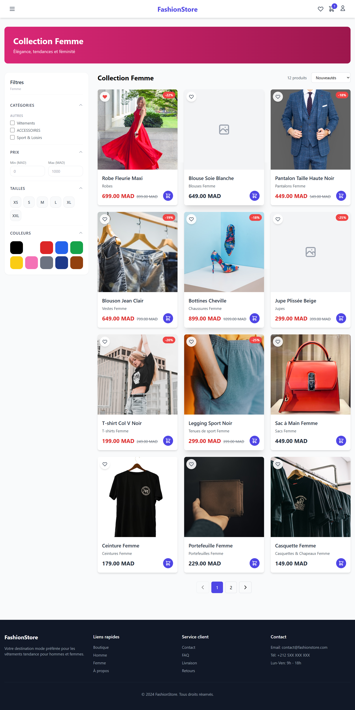
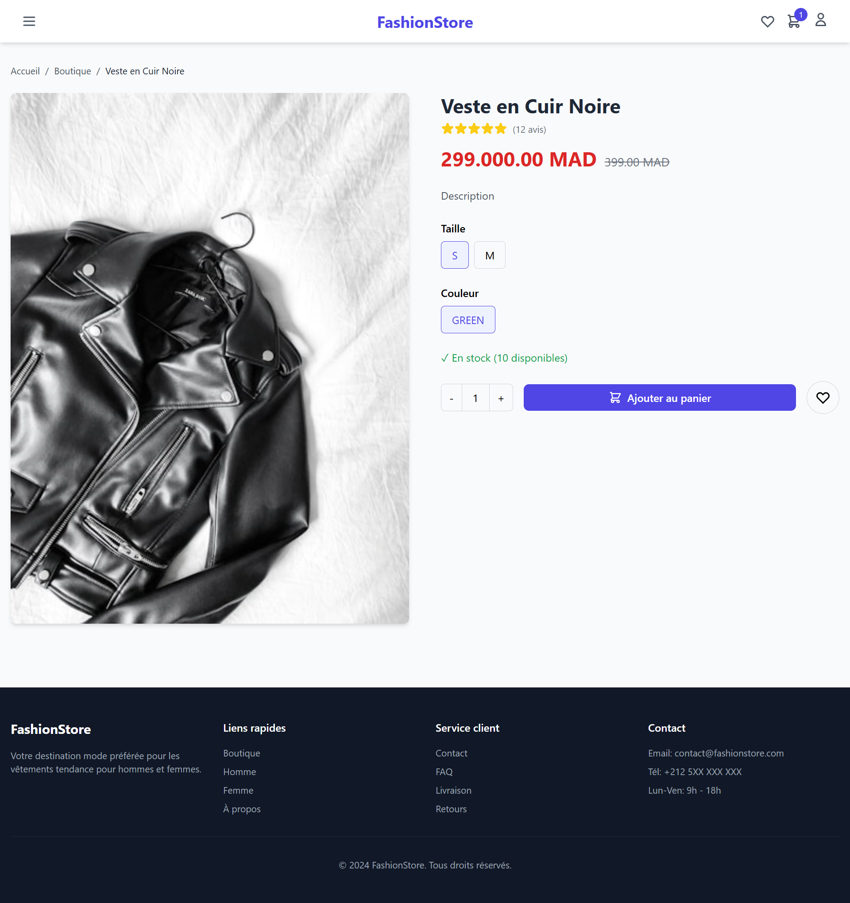
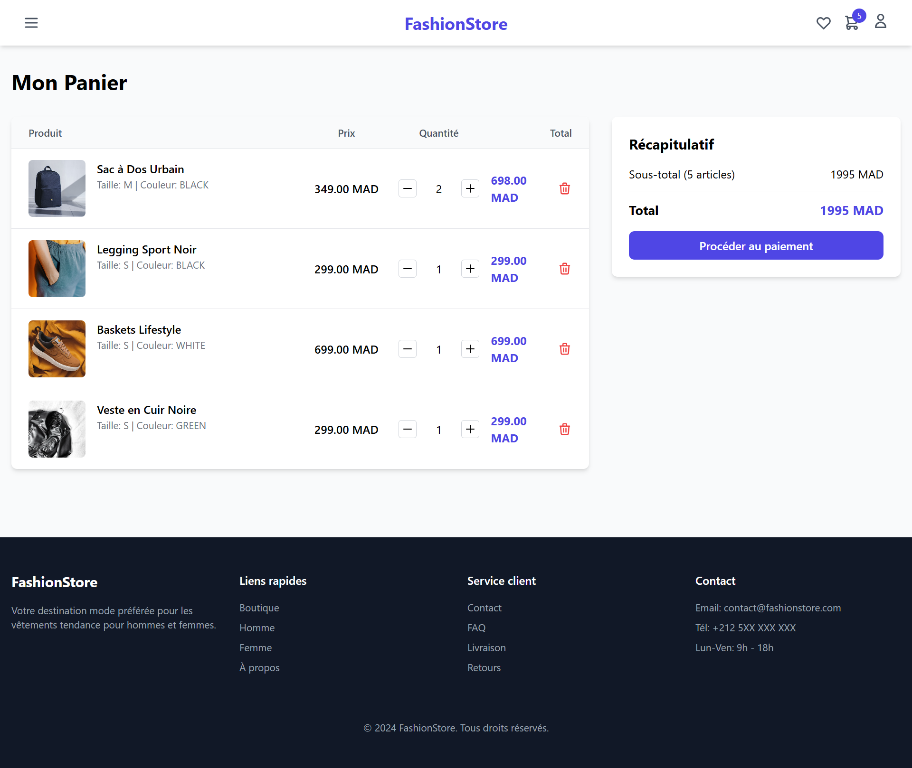
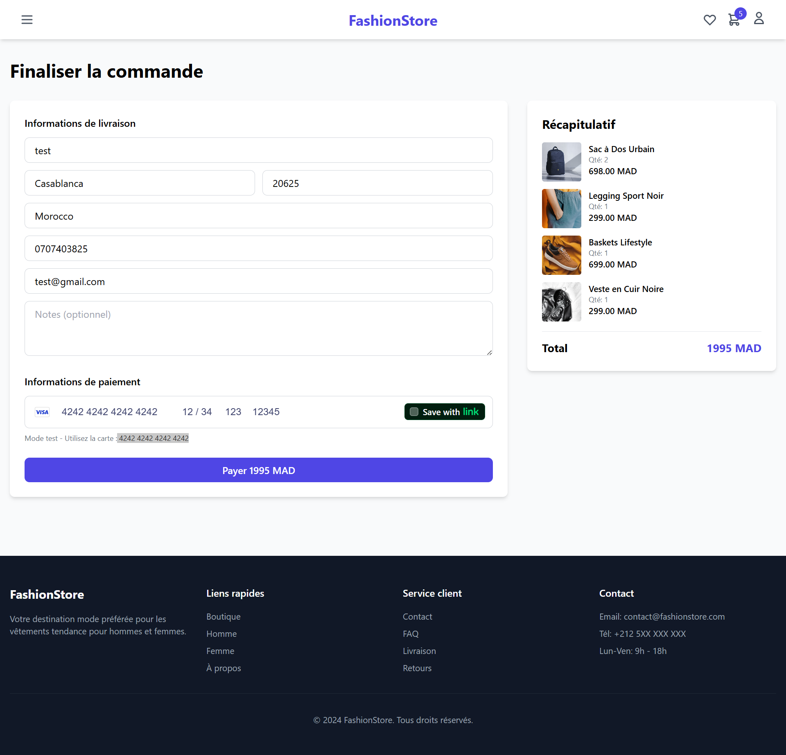
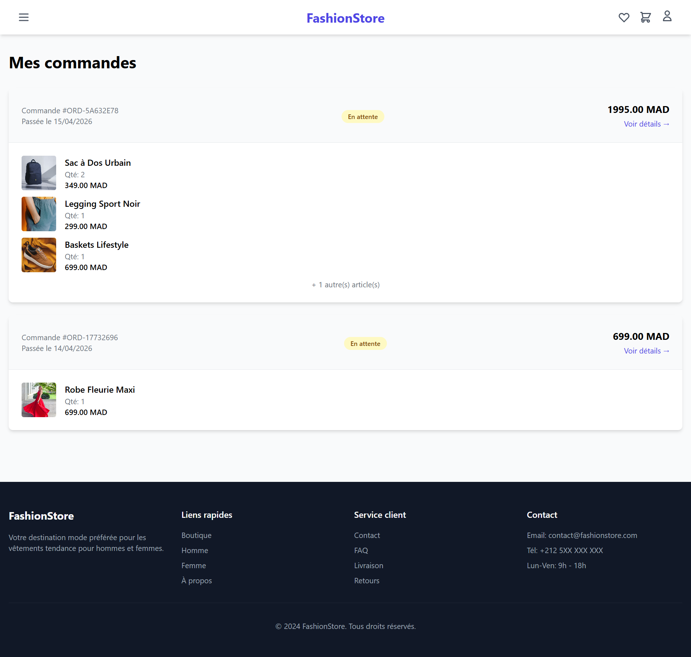
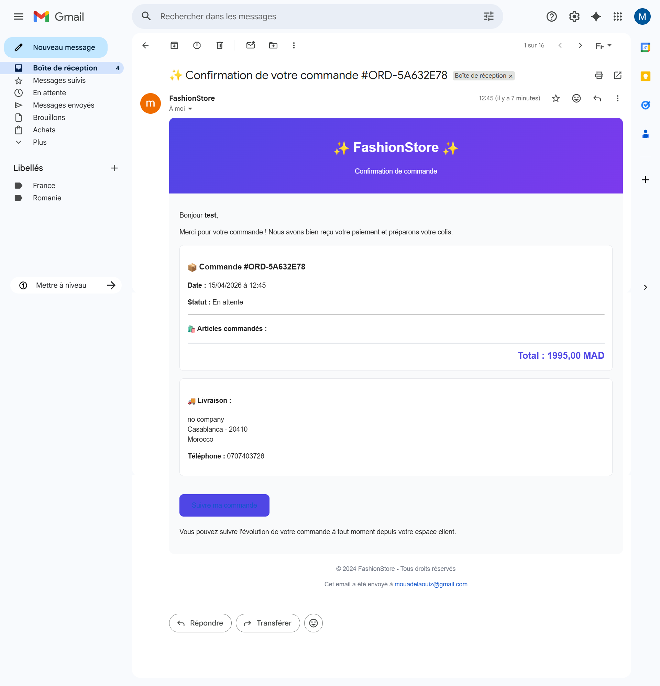

# 👕 FashionStore - Plateforme E-commerce de Vêtements

[](https://reactjs.org/)
[](https://www.djangoproject.com/)
[](https://tailwindcss.com/)
[](https://stripe.com/)
[](https://cloudinary.com/)

## 📌 À propos du projet

**FashionStore** est une plateforme e-commerce complète pour la vente de vêtements hommes et femmes.  
L’application repose sur une architecture moderne séparant un **frontend React** (avec Vite, Tailwind CSS, Redux Toolkit) d’un **backend Django REST Framework** (JWT, Stripe, Cloudinary, emails transactionnels).

### 🎯 Objectif

Créer une expérience d'achat en ligne fluide, intuitive et sécurisée pour les clients souhaitant acheter des vêtements de qualité.

### 👥 Public cible

- Hommes et femmes recherchant des vêtements tendance
- 18-45 ans, urbains, connectés

---

## ✨ Fonctionnalités principales

### 👤 Authentification & comptes
- Inscription avec **confirmation par email** (lien d’activation valable 24h)
- Connexion sécurisée via **JWT** (JSON Web Tokens)
- Gestion de profil utilisateur (téléphone, adresse, avatar)
- Liste de souhaits (wishlist)

### 👕 Catalogue produits
- Filtrage avancé (catégorie, taille, couleur, prix)
- Recherche textuelle
- Pagination (12 produits par page)
- Produits vedettes et nouveautés
- **Images stockées sur Cloudinary** (CDN, optimisation automatique)

### 🛒 Panier & commandes
- Ajout / suppression d’articles
- Gestion des quantités
- Checkout en plusieurs étapes
- **Email de confirmation de commande** (HTML)
- **Email de confirmation de paiement** (après validation Stripe)
- Historique des commandes avec détails

### 💳 Paiement
- Intégration **Stripe** (mode test / production)
- Paiement par carte bancaire via un formulaire sécurisé
- Webhook Stripe pour la confirmation automatique des paiements

### ☁️ Stockage d’images
- Toutes les images (produits, catégories, avatars) sont hébergées sur **Cloudinary**
- Organisation automatique dans des dossiers dédiés (`media/products/`, `media/categories/`, `media/avatars/`)

---


## 🏗️ Architecture technique

```bash
┌─────────────────────────────────────────────────────────────┐
│ React Frontend │
│ (Vite + Tailwind CSS) │
│ Port 5173 │
└─────────────────────────────────────────────────────────────┘
│
│ HTTP / API
▼
┌─────────────────────────────────────────────────────────────┐
│ Django REST Framework │
│ Port 8000 │
│ │
│ ┌─────────┐ ┌─────────┐ ┌─────────┐ ┌─────────┐ │
│ │Accounts │ │Products │ │ Cart │ │ Orders │ │
│ └─────────┘ └─────────┘ └─────────┘ └─────────┘ │
└─────────────────────────────────────────────────────────────┘
│
▼
┌─────────────────────────────────────────────────────────────┐
│ SQLite │
│ (Base de données) │
└─────────────────────────────────────────────────────────────┘
```

### 📂 Structure du projet

```bash
clothing-ecommerce/
├── backend/
│   ├── apps/
│   │   ├── accounts/      # authentification, profils, wishlist
│   │   ├── products/      # catalogue, filtres, images
│   │   ├── cart/          # panier
│   │   ├── orders/        # commandes, historique, emails
│   │   └── payments/      # Stripe, webhooks
│   ├── clothing_store/    # settings, urls
│   ├── templates/         # emails HTML
│   ├── .env
│   └── manage.py
└── frontend/
    ├── src/
    │   ├── components/    # ProductCard, Navbar, etc.
    │   ├── pages/         # Home, Shop, Product, Cart, Checkout, Profile, Orders
    │   ├── store/         # Redux (auth, cart, products, filters, wishlist)
    │   ├── services/      # api.js
    │   └── hooks/         # useAuth, useCart
    ├── public/
    └── package.json
```

---


## 🛠️ Technologies utilisées


### Backend
| Technologie | Version | Rôle |
|-------------|---------|------|
| Django | 4.2 | Framework web |
| Django REST Framework | 3.14 | API REST |
| Simple JWT | 5.2 | Authentification |
| Stripe | 5.5 | Paiement en ligne |
| Cloudinary | 1.32 | Stockage d’images |
| Celery (optionnel) | 5.2 | Tâches asynchrones (emails) |

### Frontend
| Technologie | Version | Rôle |
|-------------|---------|------|
| React | 18.2 | Interface utilisateur |
| Redux Toolkit | 1.9 | Gestion d’état |
| React Router | 6.14 | Navigation |
| Tailwind CSS | 3.3 | Styles |
| Axios | 1.4 | Requêtes HTTP |
| Stripe.js | 1.54 | Formulaire de paiement |
| Framer Motion | 10.18 | Animations |

---

## 🚀 Installation et démarrage

### Prérequis
- Python 3.10+
- Node.js 18+
- npm ou yarn
- Comptes gratuits : [Stripe](https://stripe.com), [Cloudinary](https://cloudinary.com), [Gmail](https://gmail.com) (pour l’envoi d’emails)

### 1. Cloner le projet
```bash
git clone https://github.com/votre-nom/clothing-ecommerce.git
cd clothing-ecommerce

## 1. Cloner le projet

```bash
git clone https://github.com/votre-nom/clothing-ecommerce.git
cd clothing-ecommerce
```


### 2. Installation du Backend

```bash
cd backend
python -m venv venv
source venv/bin/activate  # ou venv\Scripts\activate
pip install -r requirements.txt
```

Variables d’environnement (.env)
Créez un fichier .env à la racine de backend/ en vous basant sur .env.example :

```bash
# Django
SECRET_KEY=votre_cle_unique
DEBUG=True
ALLOWED_HOSTS=localhost,127.0.0.1

# Stripe (mode test)
STRIPE_PUBLIC_KEY=pk_test_...
STRIPE_SECRET_KEY=sk_test_...

# Email (Gmail avec mot de passe d’application)
EMAIL_HOST=smtp.gmail.com
EMAIL_PORT=587
EMAIL_USE_TLS=True
EMAIL_HOST_USER=votre_email@gmail.com
EMAIL_HOST_PASSWORD=16_caracteres
DEFAULT_FROM_EMAIL=FashionStore <votre_email@gmail.com>

# Cloudinary
CLOUDINARY_CLOUD_NAME=votre_cloud
CLOUDINARY_API_KEY=votre_api_key
CLOUDINARY_API_SECRET=votre_api_secret

# Frontend URL (pour liens emails)
FRONTEND_URL=http://localhost:5173
```

Migrations et démarrage
```bash
python manage.py migrate
python manage.py createsuperuser
python manage.py runserver
```


### 3. Installation du Frontend

```bash
cd frontend
npm install
cp .env.example .env   # et renseignez VITE_STRIPE_PUBLIC_KEY
npm run dev
```

Le frontend sera accessible sur http://localhost:5173.

### 4. Accès à l'application

| Service | URL | Identifiants |
|---------|-----|--------------|
| Frontend | http://localhost:5173 | - |
| API Backend | http://localhost:8000/api | - |
| Admin Django | http://localhost:8000/admin | admin / admin123 |

---

## 💳 Paiement Stripe (mode test)

- Utilisez la carte de test : 4242 4242 4242 4242 (expiration future, CVC 123).

- Les paiements sont simulés sans frais réels.

- Webhook Stripe optionnel pour la confirmation automatique.

---

## ☁️ Cloudinary – Stockage des images

Toutes les images sont automatiquement uploadées sur Cloudinary lorsque vous les ajoutez via l’admin Django ou via le frontend (avatars).
Les dossiers sont organisés comme suit :

```bash
media/
├── products/          # images des produits (sous-dossier par slug)
├── categories/        # images des catégories
└── avatars/           # avatars des utilisateurs
```
---

## 📸 Captures d'écran

### Page d'accueil


### Catalogue (Homme & Femme)
| Homme | Femme |
|-------|-------|
|  |  |

### Page produit


### Panier


### Checkout


### Historique commandes


### 💳 Emails transactionnels



---

## 🔑 Comptes de démonstration

| Rôle | Identifiant | Mot de passe |
|------|-------------|--------------|
| Administrateur | admin | admin123 |
| Client | demo | demo123 |

---

## 🧪 Tests API (avec curl)

```bash 
# Connexion
curl -X POST http://localhost:8000/api/auth/login/ \
  -H "Content-Type: application/json" \
  -d '{"username":"demo","password":"demo123"}'

# Récupérer les produits
curl http://localhost:8000/api/products/products/

# Créer une commande (après avoir ajouté au panier)
curl -X POST http://localhost:8000/api/orders/create/ \
  -H "Authorization: Bearer <token>" \
  -H "Content-Type: application/json" \
  -d '{"shipping_address":"123 Rue Test","shipping_city":"Casablanca",...}'
```
---

## 🔮 Améliorations futures

- Mode sombre

- PWA (installation sur mobile)

- Chatbot support client

- Recommandations personnalisées (IA)

- Multi-langues (français/anglais/arabe)

- Système de notation produits

- Codes promotionnels

- Livraison en points relais

- Newsletter email

---

## 📞 Contact

Développeur : MOUAD El AOUIZ 

- Email : mouadelaouiz@gmail.com

- LinkedIn : linkedin.com/in/mouad-el-aouiz-310811343/

- GitHub : github.com/Mouad-El-Aouiz

---

## 📄 Licence

Ce projet est sous licence MIT - voir le fichier LICENSE pour plus de détails.

---

## 🙏 Remerciements

- Unsplash pour les images de démonstration

- Stripe pour la solution de paiement

- Heroicons pour les icônes

---

## ⭐ Aidez-moi à améliorer ce projet

Si ce projet vous a plu, n'hésitez pas à :

- ⭐ Mettre une étoile sur GitHub

- 🍴 Forker le projet

- 📢 Le partager autour de vous

---

## Développé avec ❤️ par MOUAD EL AOUIZ


